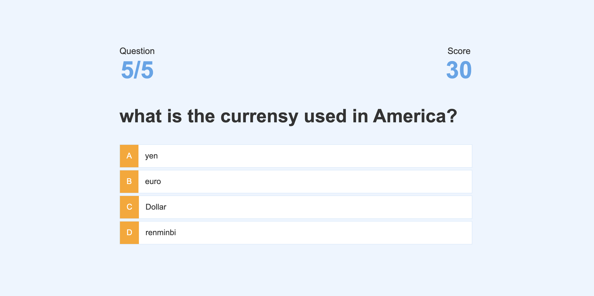

# Code Quiz

 
## Description
This app presents a user with a quiz regarding JavaScript. When a user presses the "Start Quiz" button, a timer starts and a question and answer set it presented to the user. When the user selects the correct answer, it notifies them that they are correct and 1 point is added to the user's scores. If the user selects the incorrect answer, it notifies them that they are incorrect and 10 seconds are subtracted from the timer. If the timer reaches zero or the user answers all of the questions, the game ends and presents the user their final score. The user can input their initials and save their score. After inputing their initials, the user has an opportunity to play again or clear the current score.

## Technologies
* Languages, frameworks, various tools
    * HTML, JavaScript, and Bootstrap

## Challenges
* Your experience building this app
    * I felt like I put a lot of work building this app.  There were times where I would spend a lot of time just to solve one problem.  Because I spent a lot of time trying to solve one problem, it felt like I was making very slow progress and that would get frustrating.  However, once I figured out what I needed to figure out it felt good and the concepts regarding JavaScript seem to make more sense.
* What was difficult
     * One of the difficult parts of this homework I had was trying to get the correct answer set to show up with the question it belonged to.  Another difficult part was trying to get the questions, answers, and game over screen to pop up when the buttons were clicked on.
* What did you learn
    * I learned the basic process of using JavaScript to create, add, and change elements within the HTML.
* How did you go about solving a problem
    * To solve a problem, I would write down what the problem was, and ask myself questions on how to accomplish it.  I would then look at the problem and break it down into very simple steps and try to tackle those simple steps.
    * I used the console and alerts to check to make sure I was getting the behavior I wanted.
    * I would review my notes from class, attend office hours, and talk to a tutor.

## Screenshot

